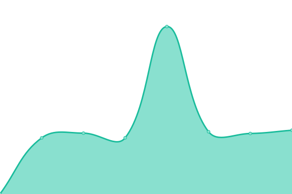

# [📈 Live Status](https://WPContained.github.io/upptime): <!--live status--> **🟧 Partial outage**

This repository contains the open-source uptime monitor and status page for [WPContained](https://WPContained.github.io/upptime), powered by [Upptime](https://github.com/upptime/upptime).

With [Upptime](https://upptime.js.org), you can get your own unlimited and free uptime monitor and status page, powered entirely by a GitHub repository. We use [Issues](https://github.com/WPContained/upptime/issues) as incident reports, [Actions](https://github.com/WPContained/upptime/actions) as uptime monitors, and [Pages](https://WPContained.github.io/upptime) for the status page.

<!--start: status pages-->
<!-- This summary is generated by Upptime (https://github.com/upptime/upptime) -->
<!-- Do not edit this manually, your changes will be overwritten -->
<!-- prettier-ignore -->
| URL | Status | History | Response Time | Uptime |
| --- | ------ | ------- | ------------- | ------ |
|  [Brabys](https://www.brabys.com/za/plumbers) | 🟩 Up | [brabys.yml](https://github.com/WPContained/upptime/commits/HEAD/history/brabys.yml) | 

 3636ms
     
 | 

<a href="https://WPContained.github.io/upptime/history/brabys">100.00%</a>
    

|  [Tyremart](https://www.tyremart.co.za) | 🟩 Up | [tyremart.yml](https://github.com/WPContained/upptime/commits/HEAD/history/tyremart.yml) | 

 4817ms
     
 | 

<a href="https://WPContained.github.io/upptime/history/tyremart">100.00%</a>
    

|  [brabysebooks](http://www.brabysebooks.co.za) | 🟩 Up | [brabysebooks.yml](https://github.com/WPContained/upptime/commits/HEAD/history/brabysebooks.yml) | 

 3127ms
     
 | 

<a href="https://WPContained.github.io/upptime/history/brabysebooks">100.00%</a>
    

|  [brabysproducts](http://www.brabysproducts.co.za) | 🟩 Up | [brabysproducts.yml](https://github.com/WPContained/upptime/commits/HEAD/history/brabysproducts.yml) | 

 1263ms
     
 | 

<a href="https://WPContained.github.io/upptime/history/brabysproducts">100.00%</a>
    

|  [admin.goldenspoon.co.za](https://admin.goldenspoon.co.za) | 🟩 Up | [admin-goldenspoon-co-za.yml](https://github.com/WPContained/upptime/commits/HEAD/history/admin-goldenspoon-co-za.yml) | 

 1582ms
     
 | 

<a href="https://WPContained.github.io/upptime/history/admin-goldenspoon-co-za">100.00%</a>
    

|  [bronberg.goldenspoon.co.za](https://bronberg.goldenspoon.co.za) | 🟩 Up | [bronberg-goldenspoon-co-za.yml](https://github.com/WPContained/upptime/commits/HEAD/history/bronberg-goldenspoon-co-za.yml) | 

 1534ms
     
 | 

<a href="https://WPContained.github.io/upptime/history/bronberg-goldenspoon-co-za">100.00%</a>
    

|  [Funfwd](https://funfwd.com) | 🟥 Down | [funfwd.yml](https://github.com/WPContained/upptime/commits/HEAD/history/funfwd.yml) | 

 4921ms
     
 | 

<a href="https://WPContained.github.io/upptime/history/funfwd">0.00%</a>
    

|  [Belgotex API](https://files.belgotex.co.za/monitor.txt) | 🟩 Up | [belgotex-api.yml](https://github.com/WPContained/upptime/commits/HEAD/history/belgotex-api.yml) | 

 1149ms
     
 | 

<a href="https://WPContained.github.io/upptime/history/belgotex-api">100.00%</a>
    

|  [Glassfinder](https://glassfinder.pgsmartglass.co.za) | 🟩 Up | [glassfinder.yml](https://github.com/WPContained/upptime/commits/HEAD/history/glassfinder.yml) | 

 3404ms
     
 | 

<a href="https://WPContained.github.io/upptime/history/glassfinder">99.66%</a>
    

|  [pay.dev.swiffy.co.za](https://pay.dev.swiffy.co.za) | 🟩 Up | [pay-dev-swiffy-co-za.yml](https://github.com/WPContained/upptime/commits/HEAD/history/pay-dev-swiffy-co-za.yml) | 

 942ms
     
 | 

<a href="https://WPContained.github.io/upptime/history/pay-dev-swiffy-co-za">100.00%</a>
    

|  [Swiffy Pay](https://pay.swiffy.co.za) | 🟩 Up | [swiffy-pay.yml](https://github.com/WPContained/upptime/commits/HEAD/history/swiffy-pay.yml) | 

 1098ms
     
 | 

<a href="https://WPContained.github.io/upptime/history/swiffy-pay">99.00%</a>
    

|  [TM Promo](https://promo.tyremart.co.za) | 🟩 Up | [tm-promo.yml](https://github.com/WPContained/upptime/commits/HEAD/history/tm-promo.yml) | 

 1576ms
     
 | 

<a href="https://WPContained.github.io/upptime/history/tm-promo">100.00%</a>
    

|  [Swiffy USSD Push](https://ussdpush.swiffy.co.za/ping.txt) | 🟩 Up | [swiffy-ussd-push.yml](https://github.com/WPContained/upptime/commits/HEAD/history/swiffy-ussd-push.yml) | 

 368ms
     
 | 

<a href="https://WPContained.github.io/upptime/history/swiffy-ussd-push">100.00%</a>
    

|  [Ananzi](https://www.ananzi.co.za) | 🟩 Up | [ananzi.yml](https://github.com/WPContained/upptime/commits/HEAD/history/ananzi.yml) | 

 1902ms
     
 | 

<a href="https://WPContained.github.io/upptime/history/ananzi">100.00%</a>
    

|  [Brabys Listing](https://www.brabys.com/za/kwazulu-natal/pinetown/call-centres/brabys) | 🟩 Up | [brabys-listing.yml](https://github.com/WPContained/upptime/commits/HEAD/history/brabys-listing.yml) | 

 2355ms
     
 | 

<a href="https://WPContained.github.io/upptime/history/brabys-listing">100.00%</a>
    

|  [Brabys Listing AMP](https://www.brabys.com/za/kwazulu-natal/pinetown/call-centres/brabys?amp=1) | 🟩 Up | [brabys-listing-amp.yml](https://github.com/WPContained/upptime/commits/HEAD/history/brabys-listing-amp.yml) | 

 1109ms
     
 | 

<a href="https://WPContained.github.io/upptime/history/brabys-listing-amp">100.00%</a>
    

|  [brabys search](https://www.brabys.com/za/plumbers) | 🟩 Up | [brabys-search.yml](https://github.com/WPContained/upptime/commits/HEAD/history/brabys-search.yml) | 

 546ms
     
 | 

<a href="https://WPContained.github.io/upptime/history/brabys-search">100.00%</a>
    

|  [brabys search amp](https://www.brabys.com/za/plumbers?amp=1) | 🟩 Up | [brabys-search-amp.yml](https://github.com/WPContained/upptime/commits/HEAD/history/brabys-search-amp.yml) | 

 3063ms
     
 | 

<a href="https://WPContained.github.io/upptime/history/brabys-search-amp">100.00%</a>
    

|  [everything47](https://www.everything47.com) | 🟩 Up | [everything47.yml](https://github.com/WPContained/upptime/commits/HEAD/history/everything47.yml) | 

 5792ms
     
 | 

<a href="https://WPContained.github.io/upptime/history/everything47">100.00%</a>
    

|  [swiffy site](https://www.swiffy.co.za) | 🟩 Up | [swiffy-site.yml](https://github.com/WPContained/upptime/commits/HEAD/history/swiffy-site.yml) | 

 978ms
     
 | 

<a href="https://WPContained.github.io/upptime/history/swiffy-site">100.00%</a>
    

|  [yellowpages.bw](https://www.yellowpages.bw) | 🟩 Up | [yellowpages-bw.yml](https://github.com/WPContained/upptime/commits/HEAD/history/yellowpages-bw.yml) | 

 3824ms
     
 | 

<a href="https://WPContained.github.io/upptime/history/yellowpages-bw">100.00%</a>
    

|  [yellowpages.bw search](https://www.yellowpages.bw/results/category/Plumbers) | 🟩 Up | [yellowpages-bw-search.yml](https://github.com/WPContained/upptime/commits/HEAD/history/yellowpages-bw-search.yml) | 

 761ms
     
 | 

<a href="https://WPContained.github.io/upptime/history/yellowpages-bw-search">100.00%</a>
    

<!--end: status pages-->

[**Visit our status website →**](https://WPContained.github.io/upptime)

## 📄 License

- Powered by: [Upptime](https://github.com/upptime/upptime)
- Code: [MIT](./LICENSE) © [WPContained](https://WPContained.github.io/upptime)
- Data in the `./history` directory: [Open Database License](https://opendatacommons.org/licenses/odbl/1-0/)
